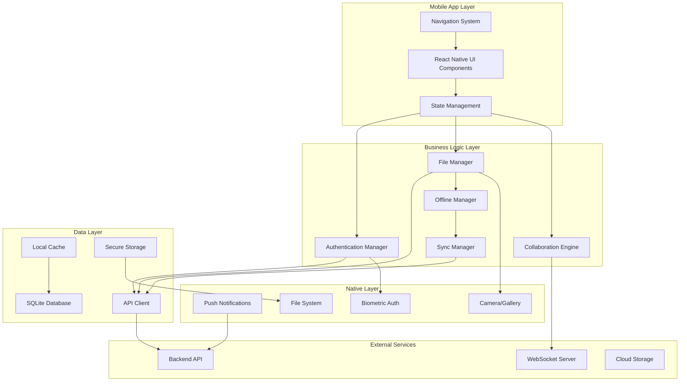

# Mobile Production Ready Design Document

## Overview

This design document outlines the architecture and implementation strategy for transforming the qubators-kingshare-mobile app into a production-ready application with full feature parity to the web client. The mobile app will be built using React Native with Expo, leveraging native mobile capabilities while maintaining a consistent user experience across platforms.

## Architecture

### High-Level Architecture



### Technology Stack

- **Framework**: React Native with Expo SDK 54
- **Navigation**: Expo Router (file-based routing)
- **State Management**: Zustand (consistent with web client)
- **API Client**: Axios with interceptors
- **Database**: SQLite with Expo SQLite
- **Authentication**: Expo SecureStore + Biometric authentication
- **File Handling**: Expo DocumentPicker, ImagePicker, FileSystem
- **Push Notifications**: Expo Notifications
- **Real-time**: Socket.IO client
- **Offline Support**: React Query with persistence
- **UI Components**: React Native Elements + Custom components

## Components and Interfaces

### Core Components

#### 1. Authentication System
```typescript
interface AuthenticationManager {
  login(credentials: LoginCredentials): Promise<AuthResult>
  logout(): Promise<void>
  refreshToken(): Promise<string>
  enableBiometric(): Promise<boolean>
  authenticateWithBiometric(): Promise<AuthResult>
  checkAuthStatus(): Promise<boolean>
}

interface BiometricAuth {
  isAvailable(): Promise<boolean>
  authenticate(): Promise<boolean>
  enableForUser(): Promise<void>
  disableForUser(): Promise<void>
}
```

#### 2. File Management System
```typescript
interface FileManager {
  getFiles(folderId?: string): Promise<FileItem[]>
  uploadFile(file: FileUpload): Promise<UploadResult>
  downloadFile(fileId: string): Promise<string>
  createFolder(name: string, parentId?: string): Promise<FileItem>
  moveFile(fileId: string, targetFolderId: string): Promise<boolean>
  deleteFile(fileId: string): Promise<boolean>
  shareFile(fileId: string, permissions: SharePermissions): Promise<ShareResult>
}

interface OfflineManager {
  markForOffline(fileId: string): Promise<void>
  removeFromOffline(fileId: string): Promise<void>
  getOfflineFiles(): Promise<FileItem[]>
  syncOfflineChanges(): Promise<SyncResult>
}
```

#### 3. Document Editors
```typescript
interface DocumentEditor {
  createDocument(type: DocumentType): Promise<Document>
  openDocument(documentId: string): Promise<Document>
  saveDocument(document: Document): Promise<boolean>
  collaborateOnDocument(documentId: string): Promise<CollaborationSession>
}

interface SpreadsheetEngine {
  createSpreadsheet(): Promise<Spreadsheet>
  openSpreadsheet(spreadsheetId: string): Promise<Spreadsheet>
  updateCell(cellId: string, value: any): Promise<boolean>
  addFormula(cellId: string, formula: string): Promise<boolean>
}
```

#### 4. UI Components
```typescript
interface MobileFileGrid {
  files: FileItem[]
  onFileSelect: (file: FileItem) => void
  onFileAction: (action: FileAction, file: FileItem) => void
  layout: 'grid' | 'list'
}

interface MobileUploadManager {
  onFileSelect: () => void
  uploadProgress: UploadProgress[]
  onCancel: (uploadId: string) => void
}

interface MobileNavigationBar {
  currentPath: PathCrumb[]
  onNavigate: (path: PathCrumb) => void
  onSearch: (query: string) => void
}
```

## Data Models

### Core Data Structures

#### File System Models
```typescript
interface MobileFileItem extends FileItem {
  isOfflineAvailable: boolean
  lastSyncedAt?: Date
  localPath?: string
  thumbnailPath?: string
  downloadProgress?: number
}

interface UploadQueue {
  id: string
  file: LocalFile
  progress: number
  status: 'pending' | 'uploading' | 'completed' | 'failed'
  retryCount: number
}

interface OfflineFile {
  fileId: string
  localPath: string
  lastModified: Date
  syncStatus: 'synced' | 'modified' | 'conflict'
}
```

#### Authentication Models
```typescript
interface MobileAuthState {
  user: User | null
  accessToken: string
  refreshToken: string
  biometricEnabled: boolean
  lastAuthTime: Date
}

interface DeviceInfo {
  deviceId: string
  platform: 'ios' | 'android'
  version: string
  pushToken?: string
}
```

### Database Schema

#### SQLite Tables
```sql
-- Offline Files
CREATE TABLE offline_files (
  id TEXT PRIMARY KEY,
  file_id TEXT NOT NULL,
  local_path TEXT NOT NULL,
  original_name TEXT NOT NULL,
  size INTEGER,
  mime_type TEXT,
  last_modified INTEGER,
  sync_status TEXT DEFAULT 'synced',
  created_at INTEGER DEFAULT (strftime('%s', 'now'))
);

-- Upload Queue
CREATE TABLE upload_queue (
  id TEXT PRIMARY KEY,
  local_path TEXT NOT NULL,
  target_folder_id TEXT,
  file_name TEXT NOT NULL,
  file_size INTEGER,
  progress INTEGER DEFAULT 0,
  status TEXT DEFAULT 'pending',
  retry_count INTEGER DEFAULT 0,
  created_at INTEGER DEFAULT (strftime('%s', 'now'))
);

-- Cache
CREATE TABLE api_cache (
  key TEXT PRIMARY KEY,
  data TEXT NOT NULL,
  expires_at INTEGER,
  created_at INTEGER DEFAULT (strftime('%s', 'now'))
);
```

## Error Handling

### Error Categories and Strategies

#### 1. Network Errors
```typescript
interface NetworkErrorHandler {
  handleConnectionLost(): void
  handleTimeout(): void
  handleServerError(status: number): void
  retryWithBackoff(operation: () => Promise<any>): Promise<any>
}
```

#### 2. Authentication Errors
```typescript
interface AuthErrorHandler {
  handleTokenExpired(): Promise<void>
  handleBiometricFailure(): void
  handleLoginFailure(error: AuthError): void
}
```

#### 3. File Operation Errors
```typescript
interface FileErrorHandler {
  handleUploadFailure(uploadId: string, error: Error): void
  handleDownloadFailure(fileId: string, error: Error): void
  handleSyncConflict(fileId: string, conflict: SyncConflict): void
}
```

### Error Recovery Mechanisms

1. **Automatic Retry**: Exponential backoff for network operations
2. **Offline Queue**: Store failed operations for retry when online
3. **User Notification**: Clear error messages with actionable steps
4. **Graceful Degradation**: Fallback to cached data when possible

## Testing Strategy

### Testing Pyramid

#### 1. Unit Tests (70%)
- Business logic functions
- Data transformation utilities
- State management stores
- API client methods

#### 2. Integration Tests (20%)
- API integration with mock server
- Database operations
- File system operations
- Authentication flows

#### 3. E2E Tests (10%)
- Critical user journeys
- Cross-platform compatibility
- Performance benchmarks
- Offline/online transitions

### Testing Tools and Frameworks

```typescript
// Jest configuration for React Native
module.exports = {
  preset: 'react-native',
  setupFilesAfterEnv: ['<rootDir>/src/test/setup.ts'],
  testMatch: ['**/__tests__/**/*.test.{js,ts,tsx}'],
  collectCoverageFrom: [
    'src/**/*.{js,ts,tsx}',
    '!src/**/*.d.ts',
    '!src/test/**/*'
  ],
  coverageThreshold: {
    global: {
      branches: 80,
      functions: 80,
      lines: 80,
      statements: 80
    }
  }
}
```

### Mock Strategies

#### API Mocking
```typescript
// Mock API responses for testing
export const mockApiClient = {
  get: jest.fn(),
  post: jest.fn(),
  put: jest.fn(),
  delete: jest.fn(),
  upload: jest.fn()
}

// Mock file system operations
export const mockFileSystem = {
  readFile: jest.fn(),
  writeFile: jest.fn(),
  deleteFile: jest.fn(),
  getInfo: jest.fn()
}
```

## Performance Optimization

### Key Performance Strategies

#### 1. Lazy Loading and Code Splitting
```typescript
// Lazy load heavy components
const DocumentEditor = lazy(() => import('./components/DocumentEditor'))
const SpreadsheetEditor = lazy(() => import('./components/SpreadsheetEditor'))

// Route-based code splitting with Expo Router
export default function Layout() {
  return (
    <Stack>
      <Stack.Screen name="(tabs)" options={{ headerShown: false }} />
      <Stack.Screen name="document/[id]" options={{ presentation: 'modal' }} />
    </Stack>
  )
}
```

#### 2. Image and File Optimization
```typescript
interface ImageOptimization {
  generateThumbnails(file: FileItem): Promise<string>
  compressImage(uri: string, quality: number): Promise<string>
  cacheImages(urls: string[]): Promise<void>
}

// Implement progressive image loading
const OptimizedImage = ({ source, placeholder }) => {
  const [loaded, setLoaded] = useState(false)
  
  return (
    <View>
      {!loaded && <Image source={placeholder} />}
      <Image 
        source={source} 
        onLoad={() => setLoaded(true)}
        style={{ opacity: loaded ? 1 : 0 }}
      />
    </View>
  )
}
```

#### 3. Memory Management
```typescript
// Implement proper cleanup in components
useEffect(() => {
  const subscription = fileManager.subscribe(handleFileUpdate)
  
  return () => {
    subscription.unsubscribe()
    // Clean up any pending operations
    uploadManager.cancelAll()
  }
}, [])

// Use FlatList for large datasets
const FileList = ({ files }) => {
  const renderItem = useCallback(({ item }) => (
    <FileItem file={item} />
  ), [])
  
  return (
    <FlatList
      data={files}
      renderItem={renderItem}
      keyExtractor={(item) => item.id}
      removeClippedSubviews={true}
      maxToRenderPerBatch={10}
      windowSize={10}
    />
  )
}
```

### Performance Monitoring

```typescript
// Performance tracking
interface PerformanceMetrics {
  trackScreenLoad(screenName: string, duration: number): void
  trackApiCall(endpoint: string, duration: number): void
  trackFileOperation(operation: string, fileSize: number, duration: number): void
}

// Memory usage monitoring
const useMemoryMonitor = () => {
  useEffect(() => {
    const interval = setInterval(() => {
      if (__DEV__) {
        console.log('Memory usage:', performance.memory?.usedJSHeapSize)
      }
    }, 10000)
    
    return () => clearInterval(interval)
  }, [])
}
```

## Security Considerations

### Data Protection

#### 1. Secure Storage
```typescript
interface SecureStorageManager {
  storeSecurely(key: string, value: string): Promise<void>
  retrieveSecurely(key: string): Promise<string | null>
  removeSecurely(key: string): Promise<void>
  clearAll(): Promise<void>
}

// Implementation using Expo SecureStore
export const secureStorage: SecureStorageManager = {
  async storeSecurely(key: string, value: string) {
    await SecureStore.setItemAsync(key, value, {
      requireAuthentication: true,
      authenticationPrompt: 'Authenticate to access your data'
    })
  }
  // ... other methods
}
```

#### 2. Network Security
```typescript
// Certificate pinning for API calls
const apiClient = axios.create({
  baseURL: API_BASE_URL,
  timeout: 30000,
  // Add certificate pinning in production
})

// Request/Response encryption for sensitive data
interface EncryptionService {
  encrypt(data: string): Promise<string>
  decrypt(encryptedData: string): Promise<string>
}
```

#### 3. Biometric Authentication
```typescript
const BiometricAuthService = {
  async isAvailable(): Promise<boolean> {
    const compatible = await LocalAuthentication.hasHardwareAsync()
    const enrolled = await LocalAuthentication.isEnrolledAsync()
    return compatible && enrolled
  },
  
  async authenticate(): Promise<boolean> {
    const result = await LocalAuthentication.authenticateAsync({
      promptMessage: 'Authenticate to access Qub Drive',
      fallbackLabel: 'Use passcode',
      cancelLabel: 'Cancel'
    })
    return result.success
  }
}
```

## Deployment Strategy

### Build Configuration

#### Development Build
```json
{
  "expo": {
    "name": "Qub Drive Dev",
    "slug": "qub-drive-dev",
    "scheme": "qubdrive-dev",
    "version": "1.0.0",
    "platforms": ["ios", "android"],
    "extra": {
      "apiUrl": "http://localhost:5001/api",
      "environment": "development"
    }
  }
}
```

#### Production Build
```json
{
  "expo": {
    "name": "Qub Drive",
    "slug": "qub-drive",
    "scheme": "qubdrive",
    "version": "1.0.0",
    "platforms": ["ios", "android"],
    "extra": {
      "apiUrl": "https://api.qubdrive.com",
      "environment": "production"
    },
    "updates": {
      "enabled": true,
      "checkAutomatically": "ON_LOAD",
      "fallbackToCacheTimeout": 0
    }
  }
}
```

### CI/CD Pipeline

```yaml
# GitHub Actions workflow
name: Mobile App CI/CD
on:
  push:
    branches: [main, develop]
  pull_request:
    branches: [main]

jobs:
  test:
    runs-on: ubuntu-latest
    steps:
      - uses: actions/checkout@v3
      - uses: actions/setup-node@v3
      - run: npm install
      - run: npm test
      - run: npm run lint
      
  build:
    needs: test
    runs-on: ubuntu-latest
    steps:
      - uses: actions/checkout@v3
      - uses: expo/expo-github-action@v8
      - run: expo build:android --type apk
      - run: expo build:ios --type archive
```

This design provides a comprehensive foundation for building a production-ready mobile application that matches the functionality of the web client while leveraging mobile-specific capabilities and maintaining excellent performance and security standards.